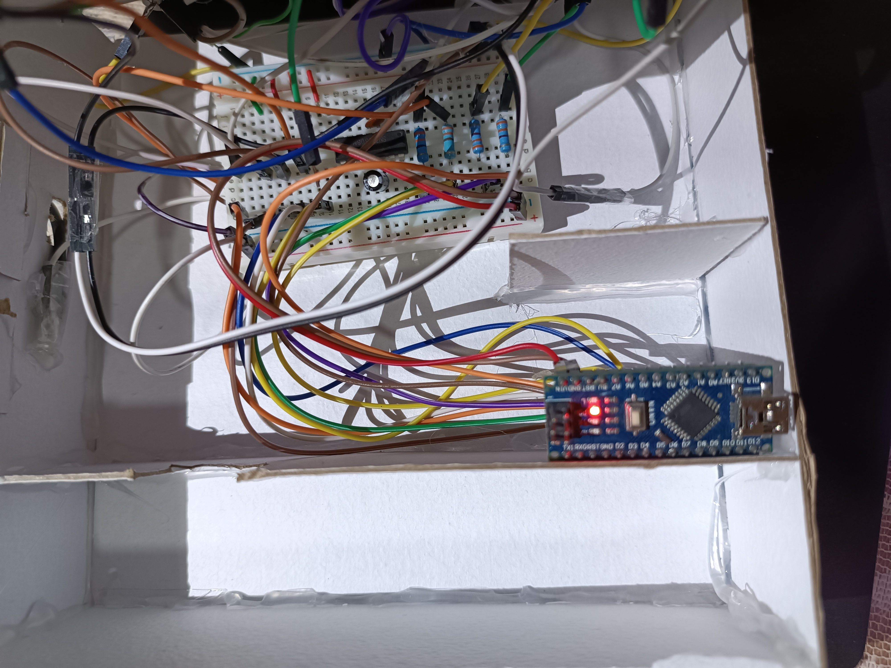
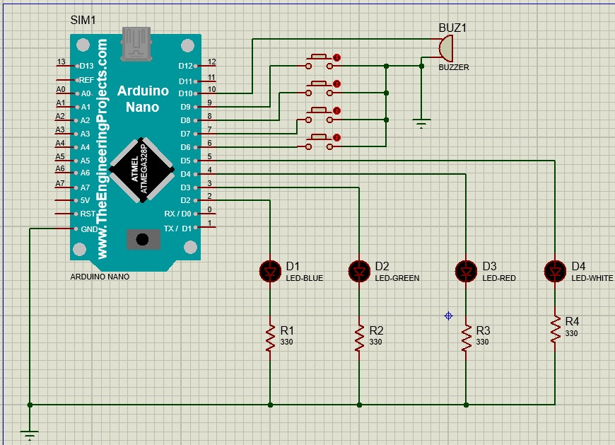

# Simon Says Game | Arduino Nano

An interactive, embedded memory game developed in C for the Arduino Nano. The system implements electronic state-machine logic to generate random light and sound sequences that the player must replicate using push-buttons.

[]

---

## 🛠️ Hardware Components

* **1x** Arduino Nano (ATmega328P)
* **4x** LEDs (Blue, Green, Red, White)
* **4x** Push-buttons
* **4x** 330Ω Resistors (Pull-down for LEDs)
* **1x** 8Ω 0.25W Speaker / Piezo Buzzer
* **1x** 5V Power Supply / Adapter (Connected via Vin and GND)
* Dupont jumper wires & breadboard

---

## 📐 Circuit Diagram

Below is the schematic diagram for the project setup. The buttons utilize the ATmega328P's internal `INPUT_PULLUP` resistors, pulling the signal to `LOW` when pressed.

---

## 💻 Software Logic & Features

The firmware is written in native **C/C++ (Arduino)** and leverages efficient memory management and structural control:

* **State-Machine Workflow:** Seamless transition between game phases (Sequence Playback, User Input Verification, Level Up, and Game Over states).
* **Dynamic Validation:** Implements sequential matching that compares user input button-by-button against a dynamically growing array sequence.
* **Hardware Debouncing:** Software-based debouncing loop handling to prevent mechanical contact noise on push-buttons.
* **Random Seeding:** Uses an unconnected analog pin (`analogRead(A0)`) to seed the random generator, ensuring a completely unique sequence every game session.

---

## ⚙️ Pin Mapping Reference

| Component | Pin Type | Arduino Nano Pin | Connection Detail |
|---|---|---|---|
| Blue LED | Output | `D2` | Connected via 330Ω resistor to GND |
| Green LED | Output | `D3` | Connected via 330Ω resistor to GND |
| Red LED | Output | `D4` | Connected via 330Ω resistor to GND |
| White LED | Output | `D5` | Connected via 330Ω resistor to GND |
| Button 1 | Input (Pull-up) | `D6` | Pulls to GND when pressed |
| Button 2 | Input (Pull-up) | `D7` | Pulls to GND when pressed |
| Button 3 | Input (Pull-up) | `D8` | Pulls to GND when pressed |
| Button 4 | Input (Pull-up) | `D9` | Pulls to GND when pressed |
| Buzzer | Output | `D10` | Audio feedback frequency emitter |
